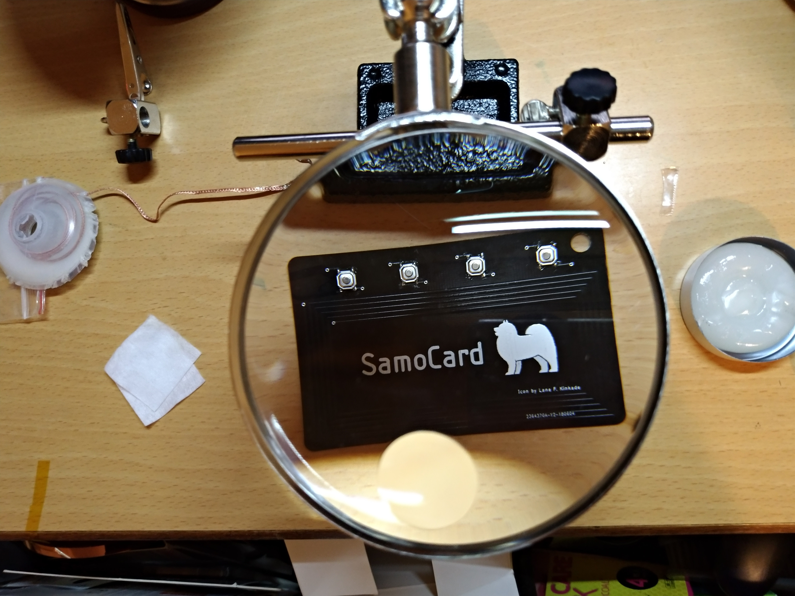
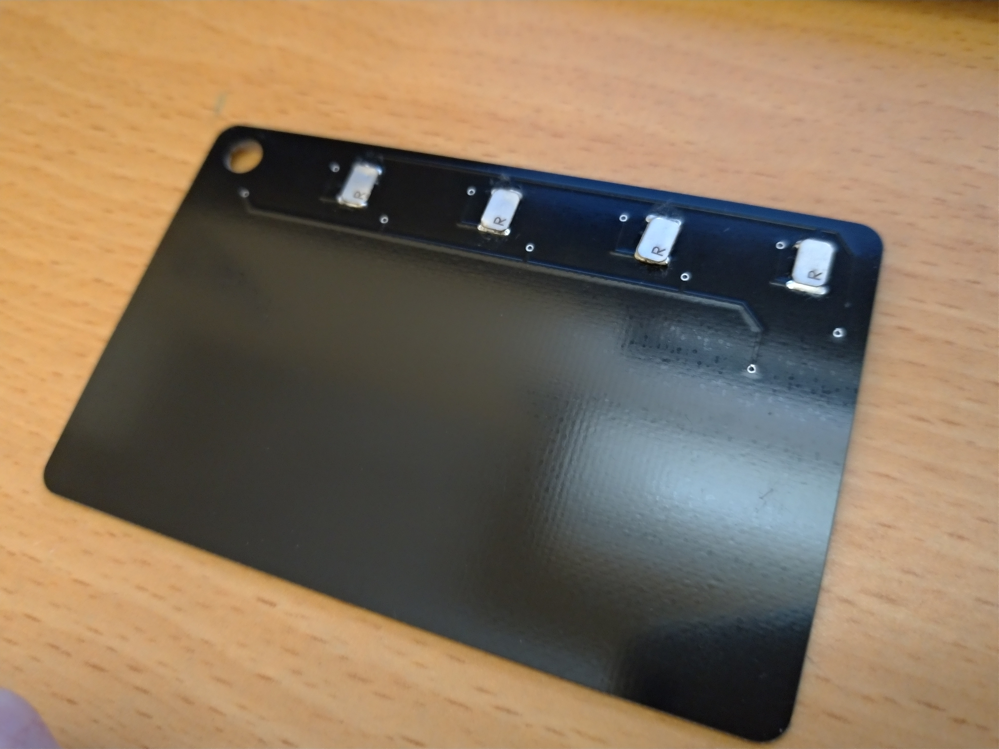

# The SamoCard

SamoCard is a 4-in-1 NFC card inspired by N-O-D-E's [NFC Key].  
With SamoCard, you can:

  - Hold 4 orginal or clone of your NFC chips in one.
  - Select which to use by simply pressing buttons.

# Materials
In order to  build yourself a SamoCard, you need:
  - **A printed SamoCard PCB**.  
    Preferably as thin as possible, to make it fit your wallet better.
    A normal NFC card is 1mm thick, I personally chose 0.4mm when I send it for manufature to compensate the thickness of SMD tact switches.

  - **4 KRM-1187 SMD tact switches**.  
  Of course you can edit the SamoCard EAGLE brd file to fit other type of switch you like.

  -  **4 8x5mm "Magic" mifare 1k chips** in order to clone your mifare 1k NFC cards. As always you can make changes to my design to meet your requirements.
  

## Difference between SamoCard and NFC key.
First of all, SamoCard fits two more NFC chips. 

In N-O-D-E's design, he uses ST M24SR64-YDW6T chips in order to store more information. SamoCard is designed to put much thinner and smaller chips on it. Like the ones used in bus cards and access control cards.

The antenna (Actually "*transformer*" is more technically accurate.) of the NFC key is designed outside of 13.56 Mhz NFC standard to shorten its response distance for security. Antenna of SamoCard was designed using ST's [edesign suite] so it will work just like any other 13.56Mhz NFC cards.

# Usage
Solder every components together and enjoy the 4-in-1 experience!

   
   [edesign suite]: <https://www.st.com/content/st_com/en/support/resources/edesign.html>
   [NFC Key]: <https://n-o-d-e.net/nfckey.html>
   
